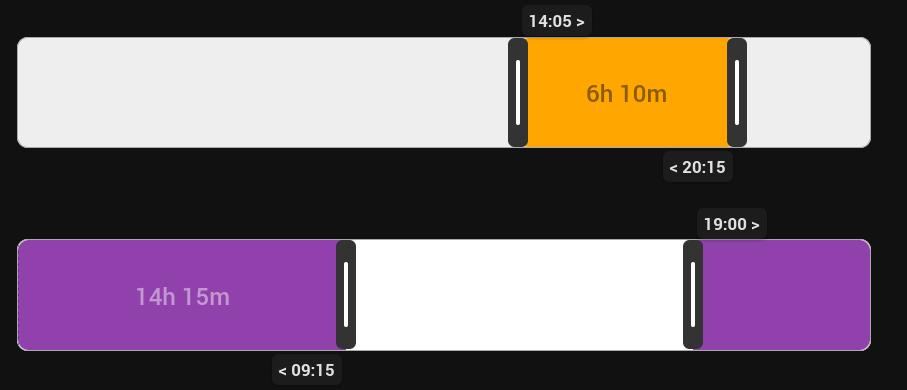

# Simple Time Range Card

A draggable time-range slider for Home Assistant Lovelace dashboards, backed by two `input_datetime` helpers. Drag either handle (or tap the bar) to set a start and end time — useful for things like quiet hours, a heating schedule, or an "away" window.



## Features

- Drag either handle to set the time
- Touch and mouse support
- Overnight ranges (e.g. 22:00 → 06:00)
- Configurable minimum gap between start and end
- Duration display that positions itself inside the bar and automatically contrasts against your configured colors
- Visual config editor (no YAML required) with entity autocomplete
- Custom bar colors

## Requirements

Two `input_datetime` helpers with a time component (`has_time: true`). You can create these under **Settings → Devices & Services → Helpers → + Create Helper → Date and/or time**, or in YAML:

```yaml
input_datetime:
  quiet_hours_start:
    name: Quiet hours start
    has_time: true
  quiet_hours_end:
    name: Quiet hours end
    has_time: true
```

## Installation

### HACS (recommended)

1. Go to HACS → Frontend → the three-dot menu → **Custom repositories**
2. Add this repository's URL, category **Dashboard**
3. Search for "Simple Time Range Card" and install
4. Add the resource (HACS usually does this automatically):
   ```yaml
   url: /hacsfiles/simple-time-range-card/simple-time-range-card.js
   type: dashboard
   ```

### Manual

1. Copy `simple-time-range-card.js` to `<config>/www/`
2. Add it as a dashboard resource: **Settings → Dashboards → three-dot menu → Resources → + Add Resource**
   - URL: `/local/simple-time-range-card.js`
   - Resource type: JavaScript module
3. Refresh your browser

## Usage

### Visual editor

Add the card from **+ Add Card → Simple Time Range Card** and configure it in the UI — no YAML needed.

### YAML

```yaml
type: custom:simple-time-range-card
entity_start: input_datetime.quiet_hours_start
entity_end: input_datetime.quiet_hours_end
bar_background: "#eee"
bar_foreground: "#4caf50"
min_gap_minutes: 5
```

## Configuration options

| Option | Type | Default | Description |
|---|---|---|---|
| `entity_start` | string | required | `input_datetime` entity for the start time |
| `entity_end` | string | required | `input_datetime` entity for the end time |
| `bar_background` | string | `#eee` | Any CSS color for the bar's background |
| `bar_foreground` | string | `#4caf50` | Any CSS color for the highlighted range |
| `min_gap_minutes` | number | `5` | Minimum allowed distance between start and end |
| `entity_start_service` | object | — | Advanced: override the domain/service called for the start entity, e.g. `{ domain: "some_domain", service: "some_service" }` |
| `entity_end_service` | object | — | Advanced: same as above, for the end entity |

`entity_start_service` / `entity_end_service` only matter if you're targeting something other than a standard `input_datetime` helper. Most users won't need them.

## Overnight ranges

If you set a start time later than the end time (e.g. 22:00 → 06:00), the card treats it as an overnight range: the highlighted fill splits and wraps around both edges of the bar instead of running through the middle, with a dashed marker at midnight. Drag a handle around the far side of the bar (rather than through the other handle) to flip a range into overnight mode.

## Notes

- Times are set in 5-minute increments while dragging.
- The card calls `input_datetime.set_datetime` on both entities as you drag.

## Support

If this extension is helping you in your daily life you can buy me a coffee.    
[](https://www.buymeacoffee.com/dodog)

## License

This project is licensed under the GNU General Public License v3.0.
